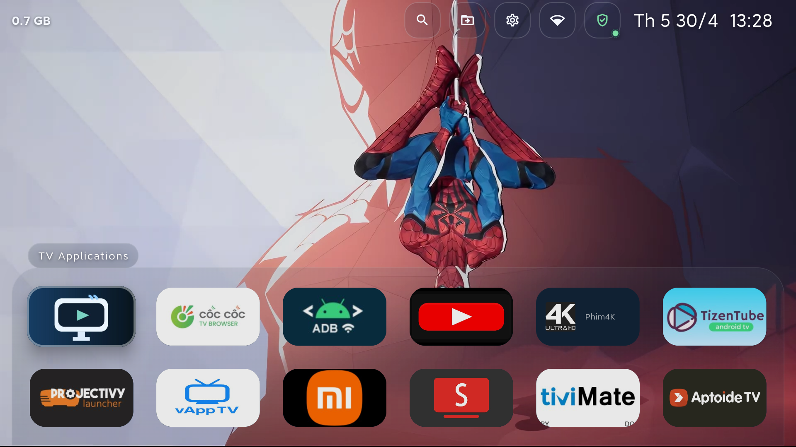
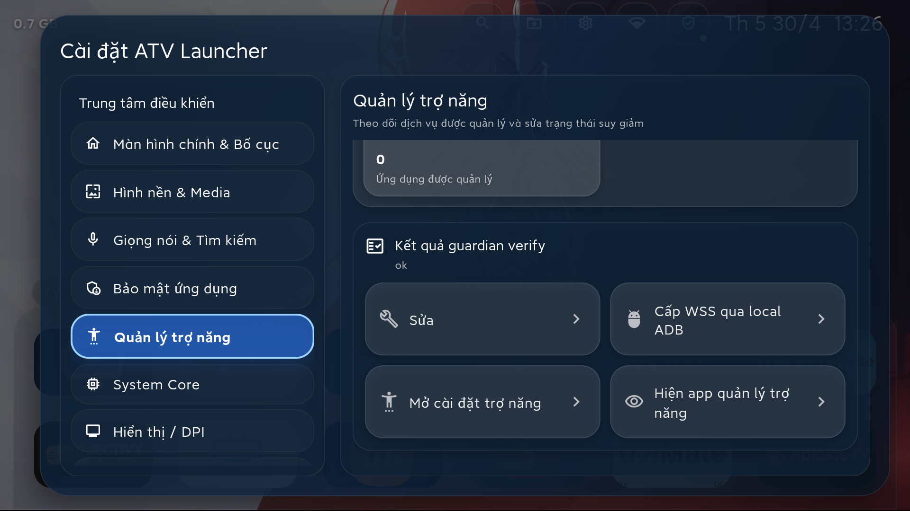

# ATV Launcher

ATV Launcher là dự án launcher Android TV cá nhân mình đang duy trì dưới tài khoản `xfire0392-netizen`, tập trung cho TV không có Google, Xiaomi TV / Mi Box và các thiết bị Android TV 9+ cần nhiều quyền hệ thống hơn launcher thông thường.

Fork này lấy nền từ [`osrosal/flauncher`](https://github.com/osrosal/flauncher) tag `v2025.07.001`, sau đó mở rộng thành một APK launcher tích hợp cho:

- Android TV không phụ thuộc Google Play Services
- one-time ADB provisioning rồi tự heal sau boot / wake
- voice remap, accessibility repair, DPI, private DNS và diagnostics ngay trong launcher
- video wallpaper local / playlist / folder playlist
- UI song ngữ English / Tiếng Việt

## Cá nhân hóa của fork này

ATV Launcher không còn là một mirror tối giản của upstream. Bản fork hiện tại ưu tiên:

- Xiaomi TV / Mi Box stability
- launcher recovery khi TV cố quay về home mặc định khác
- bottom dock home để lộ video wallpaper nhiều hơn
- Permission Center, backup / restore và settings shell kiểu TV-first
- tích hợp native system bridge vào cùng app launcher

## Tính năng chính

### Home & media

- Bottom dock home với preset số hàng hiển thị, auto-collapse và glass UI
- Tùy chỉnh card size, icon size, bo góc, khoảng cách hàng, độ trong suốt
- Wallpaper `gradient | image | video`
- Video wallpaper từ file đơn, nhiều file hoặc thư mục
- Playlist sequential / shuffle, on-completion / fixed interval, mute, blur, dim, fit

### System bridge

- Permission Center với flow local ADB và checklist provisioning
- Voice remap cho remote với learning mode
- Accessibility manager và repair flow
- DPI read / apply / reset
- Private DNS read / apply / reset
- Resident core, heal service, boot/wake recovery và diagnostics
- Home guard cho TV có xu hướng trả HOME về launcher gốc

### Data & recovery

- Backup / restore cấu hình launcher
- Lưu bố cục home, voice mapping, accessibility management, wallpaper config, ADB policy, DNS, DPI intent
- Song ngữ English / Tiếng Việt

## Screenshots

### Home



### Settings




## Hồ sơ kỹ thuật

- Package: `com.atv.launcher`
- Base: `osrosal/flauncher` tag `v2025.07.001`
- UI: Flutter
- Android host: Java 17
- `minSdk = 28`
- `targetSdk = 35`
- ABI phát hành chính: `armeabi-v7a`
- Không yêu cầu Google Play Services

## Install on TV

### 1. Kết nối ADB tới TV

Trong toàn bộ ví dụ bên dưới, thay `TV_IP` bằng địa chỉ IP của chính TV trên mạng nội bộ của bạn. Không dùng cứng `192.168.1.111`, vì mỗi thiết bị sẽ khác nhau.

```bash
adb connect TV_IP:5555
adb devices
```

Nếu TV chưa bật ADB / Wireless debugging, mở trong `Developer options` trên TV trước.

### 2. Cài APK

```bash
adb -s TV_IP:5555 install -r build/app/outputs/flutter-apk/app-debug.apk
```

Hoặc dùng file phát hành từ GitHub Releases sau khi workflow CI build xong.

### 3. Mở launcher

```bash
adb -s TV_IP:5555 shell monkey -p com.atv.launcher -c android.intent.category.LAUNCHER 1
```

### 4. Grant quyền cần thiết

ATV Launcher không còn hướng dẫn provisioning bằng script PC đi kèm. Luồng khuyến nghị là cấp quyền một lần ngay trong app bằng local ADB:

1. Mở `Permission Center` từ launcher.
2. Nếu ADB hoặc Wireless debugging đang tắt, dùng nút mở `Developer options` và bật chúng trên TV.
3. Quay lại `Permission Center` và bấm một nút `Grant via local ADB`.
4. Đợi launcher tự grant các quyền cần thiết, chạy verify và cập nhật checklist health.

Sau khi hoàn tất lần đầu, launcher sẽ dùng cơ chế heal / diagnostics tích hợp để tự duy trì trạng thái ổn định tốt hơn trên Xiaomi TV / Mi Box.

### 5. Cập nhật APK

```bash
adb -s TV_IP:5555 install -r path/to/atv-launcher-armeabi-v7a-debug.apk
```

### 6. Gỡ launcher nếu cần

```bash
adb -s TV_IP:5555 uninstall com.atv.launcher
```

## Build local

### Yêu cầu

- Flutter `3.24.5`
- Android SDK + platform tools
- Java `17`

### Cài dependency

```bash
flutter pub get
```

### Kiểm tra

```bash
flutter analyze --no-pub
flutter test --no-pub
```

### Build debug APK

```bash
flutter build apk --debug --target-platform android-arm --no-pub
```

### Build release APK

```bash
flutter build apk --release --target-platform android-arm --no-pub
```

## GitHub Actions / releases

Repo này dùng `main` làm nhánh phát hành tự động.

Trên mỗi push vào `main`, GitHub Actions sẽ:

- chạy `flutter analyze --no-pub`
- chạy `flutter test --no-pub`
- build debug APK Android ARM
- upload artifact APK
- tự tạo GitHub Release debug mới kèm file APK

## Upstream, credit và license

Fork này vẫn giữ credit và GPL của upstream:

- original project: [etienn01/flauncher](https://gitlab.com/flauncher/flauncher)
- Flutter fork base used here: [osrosal/flauncher](https://github.com/osrosal/flauncher)

Toàn bộ dự án tiếp tục phát hành theo giấy phép [`GPL-3.0`](LICENSE).
